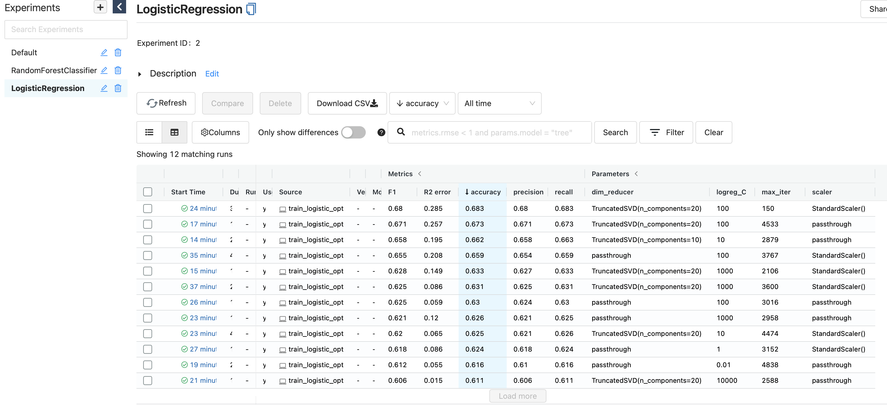
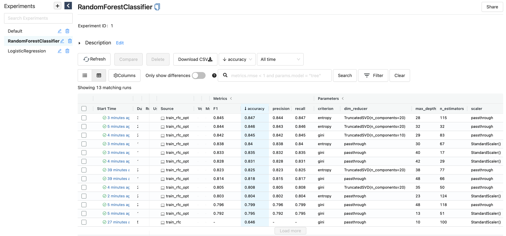
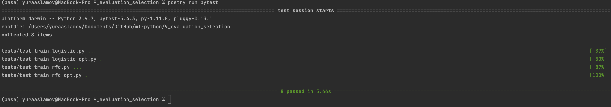
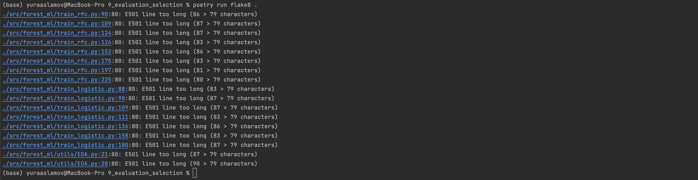

# Capstone Project

Capstone project for RS School Machine Learning course.

This demo uses [Forest Cover Type Prediction](https://www.kaggle.com/competitions/forest-cover-type-prediction/) dataset.

## Usage
This package allows you to train model for forest categories classification.
1. Clone this repository to your machine.
2. Download [Forest Cover Type Prediction](https://www.kaggle.com/competitions/forest-cover-type-prediction/) dataset, save csv locally (default path is *data/train.csv* in repository's root).
3. Make sure Python 3.9 and [Poetry](https://python-poetry.org/docs/) are installed on your machine.
4. Install the project dependencies (*run this and following commands in a terminal, from the root of a cloned repository*):
```sh
poetry install --no-dev
```
5. To generate dataset profiling report (EDA), use the following command:
```sh
poetry run dataset_profiling -d <path to csv with data>
```
or if you just want to visualize dataset:
```sh
poetry run dataset_gui -d <path to csv with data>
```

6. Run training process with the following commands:
- Logistic Regression:
```sh
poetry run train_logistic -d <path to csv with data> -s <path to save trained model>
```
- Random Forest Classifier:
```sh
poetry run train_rfc -d <path to csv with data> -s <path to save trained model>
```
You can configure additional options (such as hyperparameters) in the CLI. To get a full list of them, use help:
```sh
poetry run train_logistic --help
```
7. Run training process with optimal hyperparameters search with the following commands:
- Logistic Regression:
```sh
poetry run train_logistic_opt -d <path to csv with data> -s <path to save trained model>
```
- Random Forest Classifier:
```sh
poetry run train_rfc_opt -d <path to csv with data> -s <path to save trained model>
```
8. Run MLflow UI to see the information about experiments you conducted:
```sh
poetry run mlflow ui
```
Experiment results for Logistic Regression and Random Forest Classifier are stored in different folders:



## Development

The code in this repository is tested, formatted with black, and pass mypy typechecking before being commited to the repository.

Install all requirements (including dev requirements) to poetry environment:
```
poetry install
```
Now you can use developer instruments, e.g. pytest:
```
poetry run pytest
```


Format your code with black by using poetry:
```
poetry run black src tests
```


Lint your code with flake8 by using poetry:
```
poetry run flake8 src
```

